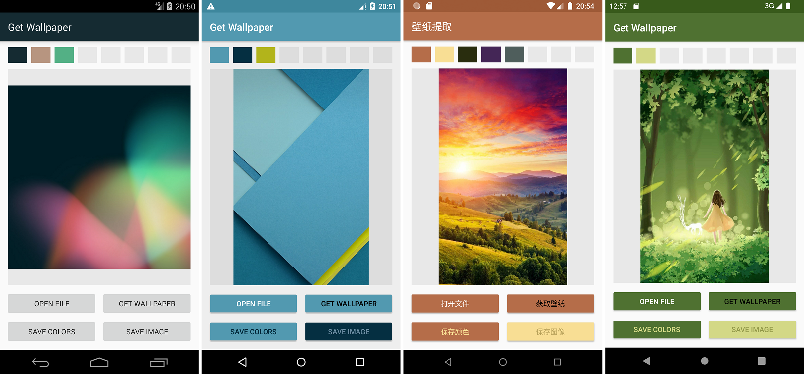

Get Wallpaper
==============

![][package] ![][latest_version] ![][build_date]  
[![][license]][license_link] ![][made_with] ![][api_tested]![][api_supported]

[package]: https://img.shields.io/badge/Package-wmsdf.cl.exp4.getwallpaper-lightgrey.svg?style=flat-square
[latest_version]: https://img.shields.io/badge/Version-1.3%20(1300)-green.svg?style=flat-square
[build_date]: https://img.shields.io/badge/Build%20date-20220817%20枪毙节快乐！-blue.svg?style=flat-square
[license]: https://img.shields.io/badge/License-GNU%20GPL%20v3-blue.svg?style=flat-square
[license_link]: https://www.gnu.org/licenses/gpl-3.0.en.html
[made_with]: https://img.shields.io/badge/Made%20with-Android%20Studio-green.svg?style=flat-square
[api_tested]: https://img.shields.io/badge/Android%20version-4.4|5.1|7.1|8.1|12.0-darkblue.svg?style=flat-square
[api_supported]: https://img.shields.io/badge/≥4.4-blue.svg?style=flat-square

A ~~minimalistic~~ boring app that pull out your current launcher and lockscreen wallpaper.

~~Actually the main purpose of this app is not getting wallpapers. I'm trying to test the MMCQ method of color palette extraction.~~

## Building

This is an Android Studio project repository, and the easiest way to build is to open it with Android Studio.

## Usage

Open the app, click "Get wallpaper" to get the current launcher wallpaper.

On Android 7+, long click the button will get the lockscreen wallpaper. Due to use of custom lockscreen engine, it may not be able to get the actual background used.

Click "Save image" to save the image to your Download folder.

## Reference~~s~~

[Java implementation of MMCQ color theme method](https://blog.csdn.net/hegan2010/article/details/84308152)
